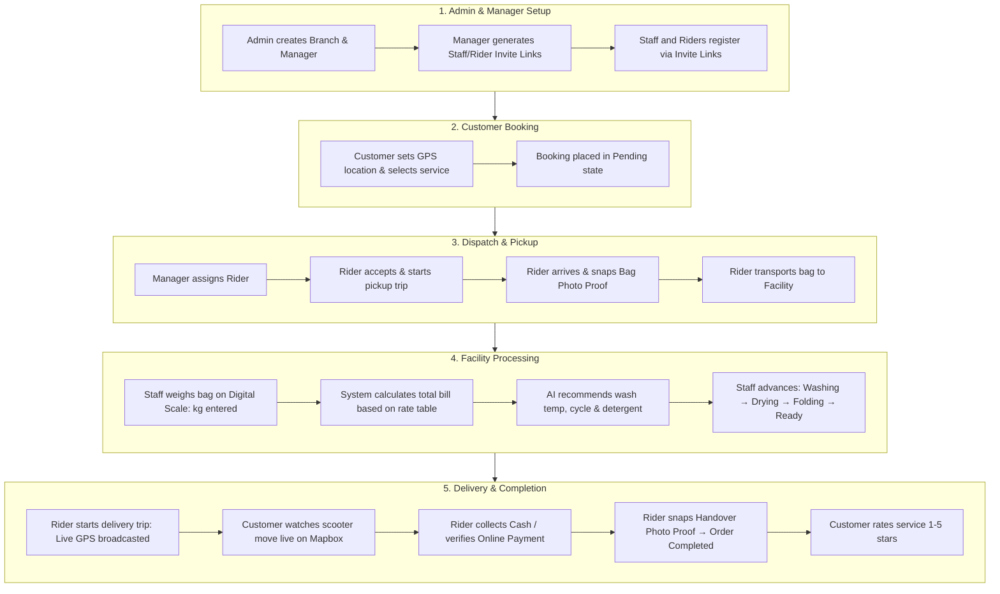

# 🧺 WashGo — Complete System Functions & Operational Flow Manual

> **WashGo** is an enterprise multi-tenant, on-demand laundry operations and delivery platform built with **Next.js 16 (App Router)**, **Supabase (PostgreSQL + RLS + Realtime)**, **Mapbox GL JS**, and **PayMongo**.

---

## 📑 Table of Contents
1. [🔐 Quick Login Credentials](#-quick-login-credentials)
2. [🔄 End-to-End System Operational Flow](#-end-to-end-system-operational-flow)
   - [Phase 1: Platform Setup & Branch Provisioning (Superadmin)](#phase-1-platform-setup--branch-provisioning-superadmin)
   - [Phase 2: Team Onboarding & Custom Pricing (Branch Manager)](#phase-2-team-onboarding--custom-pricing-branch-manager)
   - [Phase 3: Order Placement & Dispatch (Customer & Manager)](#phase-3-order-placement--dispatch-customer--manager)
   - [Phase 4: Pickup Navigation & Bag Verification (Rider & Customer)](#phase-4-pickup-navigation--bag-verification-rider--customer)
   - [Phase 5: Counter Weigh Intake & AI Wash Care (Facility Staff)](#phase-5-counter-weigh-intake--ai-wash-care-facility-staff)
   - [Phase 6: Machine Workflow & Packing (Facility Staff)](#phase-6-machine-workflow--packing-facility-staff)
   - [Phase 7: Delivery Navigation & Live Map Telemetry (Rider & Customer)](#phase-7-delivery-navigation--live-map-telemetry-rider--customer)
   - [Phase 8: Payment Handover, Photo Proof & Rating (Rider & Customer)](#phase-8-payment-handover-photo-proof--rating-rider--customer)
3. [⚙️ Detailed Functions Catalog by Role](#️-detailed-functions-catalog-by-role)
   - [👑 1. Superadmin Functions (`/admin`)](#1-superadmin-functions-admin)
   - [🏢 2. Branch Manager Functions (`/manager`)](#2-branch-manager-functions-manager)
   - [🧺 3. Facility Staff Functions (`/staff`)](#3-facility-staff-functions-staff)
   - [🛵 4. Delivery Rider Functions (`/rider`)](#4-delivery-rider-functions-rider)
   - [👤 5. Customer Functions (`/customer`)](#5-customer-functions-customer)
   - [🤖 6. Automated Backend & AI Functions](#6-automated-backend--ai-functions)
4. [📊 Order Status State Machine & Permissions](#-order-status-state-machine--permissions)
5. [🚀 Setup & Deployment](#-setup--deployment)

---

## 🔐 Quick Login Credentials

> **Login URL:** `https://gowashgo.vercel.app/login` (or `/login` locally)  
> **Universal Password for all seeded accounts:** `password123`

| Role | Email | Password | Portal URL | Layout Type |
| :--- | :--- | :--- | :--- | :--- |
| **👑 Superadmin** | `admin@washgo.ph` | `password123` | `/admin` | Desktop Portal |
| **🏢 Branch Manager** | `manager@washgo.ph` | `password123` | `/manager` | Desktop Portal |
| **🧺 Facility Staff** | `staff@washgo.ph` | `password123` | `/staff` | Desktop/Tablet Workstation |
| **🛵 Delivery Rider** | `rider@washgo.ph` | `password123` | `/rider` | Mobile Web App (PWA) |
| **👤 Customer** | `customer@washgo.ph` | `password123` | `/customer` | Mobile Web App (PWA) |

---

## 🔄 End-to-End System Operational Flow

The diagram below outlines the entire lifecycle of an order from platform configuration to final customer delivery:



---

### Phase 1: Platform Setup & Branch Provisioning (Superadmin)
1. **Superadmin Logs In:** Navigates to `/admin`.
2. **Creates Branch:**
   * Opens `/admin/branches/new`.
   * Interactively selects branch location on Mapbox map (coordinates & address auto-filled).
   * Sets default `₱/kg` rate, contact details, and base turnaround time.
   * Checks **"Create Initial Branch Manager Account"** and inputs manager email (e.g. `manager.sanjuan@washgo.ph`).
3. **Outcome:** The branch record is created in PostgreSQL and the manager account is immediately provisioned in Supabase Auth.

---

### Phase 2: Team Onboarding & Custom Pricing (Branch Manager)
1. **Branch Manager Logs In:** Navigates to `/manager`.
2. **Generates Team Invites:**
   * Goes to `/manager/invites`.
   * Selects role (`staff` or `rider`) and clicks **Generate Invite Link**.
   * Sends the unique URL (e.g. `https://gowashgo.vercel.app/invite/ABC123XYZ`) to employees.
3. **Staff/Rider Onboarding:**
   * Employee opens link, inputs full name, phone number, and password.
   * Account is created with the exact assigned role and tied to the manager's `branch_id`.
4. **Sets Branch Pricing (`/manager/pricing`):**
   * Configures base laundry rate per kg (e.g. `₱35.00/kg`) plus specific rates for heavy jackets, bedsheets, or delicates.

---

### Phase 3: Order Placement & Dispatch (Customer & Manager)
1. **Customer Places Booking (`/customer/book`):**
   * Uses device GPS auto-detection or map pin to set pickup address.
   * Selects service category (Regular Wash & Fold, Beddings, Premium Care).
   * Chooses pickup time slot and payment preference (Cash or Online GCash/Maya).
   * Submits booking &rarr; Order status: `pending`.
2. **Order Assignment:**
   * Branch Manager opens `/manager/orders` and confirms order &rarr; status: `confirmed`.
   * Assigns an available branch rider &rarr; status: `rider_assigned`.

---

### Phase 4: Pickup Navigation & Bag Verification (Rider & Customer)
1. **Rider Accepts Job (`/rider`):**
   * Rider receives dispatch notification on mobile cockpit.
   * Taps **Accept & Start Pickup** &rarr; status: `pickup_en_route`.
2. **Road Navigation:**
   * Mapbox draws live driving route with distance (km) and estimated arrival time (~mins).
3. **Customer Verification:**
   * Customer shows on-screen **QR Pickup Pass** or handwritten bag label to rider.
4. **Mandatory Bag Photo:**
   * Rider opens **Confirm Pickup Modal**, takes/uploads a photo of the laundry bag, and confirms.
   * Status updates to `picked_up` with bag photo uploaded to cloud storage.
5. **Facility Dropoff:**
   * Rider brings laundry to branch & taps **Arrived at Branch** &rarr; status: `at_facility`.

---

### Phase 5: Counter Weigh Intake & AI Wash Care (Facility Staff)
1. **Staff Weighed Intake (`/staff`):**
   * Staff opens the order in the **Counter Intake Modal**.
   * Enters verified scale weight in kilograms (e.g. `4.5 kg`).
   * System recalculates final order bill: $\text{Weight (kg)} \times \text{Branch Rate (₱/kg)}$.
2. **AI Wash Recommendation:**
   * AI inspects load type and tags to recommend:
     - **Water Temperature:** Cold ($30^\circ\text{C}$), Warm ($40^\circ\text{C}$), or Hot ($60^\circ\text{C}$).
     - **Cycle:** Delicate / Normal / Heavy Soil.
     - **Detergent & Softener Dosage:** Precise ml calculations per kg load.
3. **Notification Sent:**
   * Customer receives an instant notification with verified weight and exact amount due.

---

### Phase 6: Machine Workflow & Packing (Facility Staff)
Staff advances the order across production stages with 1 click per milestone:
1. **Start Wash** &rarr; status: `washing`
2. **Move to Dryer** &rarr; status: `drying`
3. **Folding & QA** &rarr; status: `folding`
4. **Pack & Tag** &rarr; status: `ready_for_delivery`

---

### Phase 7: Delivery Navigation & Live Map Telemetry (Rider & Customer)
1. **Rider Starts Delivery:**
   * Rider taps **Start Delivery** on `/rider` &rarr; status: `delivery_en_route`.
2. **Live Telemetry Emission:**
   * Rider app emits GPS telemetry every 6 seconds to Supabase Realtime channel.
   * Built-in Screen Wake Lock keeps screen awake during transit.
3. **Customer Real-Time View (`/customer/orders/[id]`):**
   * Customer watches the scooter icon smoothly glide across the Mapbox road network with live ETA.

---

### Phase 8: Payment Handover, Photo Proof & Rating (Rider & Customer)
1. **Payment Verification:**
   * **Online (GCash / Maya / Card):** Handover modal verifies verified status via PayMongo.
   * **Cash on Delivery (COD):** Rider collects cash and checks the mandatory confirmation checkbox.
2. **Mandatory Handover Photo:**
   * Rider captures delivery photo proof showing laundry delivered to recipient.
3. **Completion:**
   * Rider taps **Confirm & Complete** &rarr; status: `completed`.
4. **Customer Rating:**
   * Customer rates rider and branch service (1–5 stars) with optional review note.

---

## ⚙️ Detailed Functions Catalog by Role

### 👑 1. Superadmin Functions (`/admin`)
* `fn_create_branch`: Interactive Mapbox pin-picker to provision branches with geocoded coordinates.
* `fn_provision_manager`: Automates creation of initial Branch Manager auth user tied to new branch.
* `fn_system_overview`: Real-time systemwide metrics (active orders, total revenue, branch utilization).
* `fn_manage_users`: Search, filter, activate, and deactivate platform accounts.
* `fn_branch_analytics`: Inspect revenue, active workforce, and order throughput per branch.

---

### 🏢 2. Branch Manager Functions (`/manager`)
* `fn_generate_invites`: Create secure invite codes/links for onboarding Staff and Riders.
* `fn_dispatch_order`: Assign queued customer bookings to specific branch riders.
* `fn_configure_pricing`: Set custom base rate per kg (`₱/kg`) and item category rates.
* `fn_cash_settlement`: Audit rider cash collections and reconcile daily cash drawers.
* `fn_export_csv`: Export detailed branch revenue and order logs to CSV files.
* `fn_manage_fleet`: Monitor rider online status, active tasks, and performance ratings.

---

### 🧺 3. Facility Staff Functions (`/staff`)
* `fn_scale_intake`: Enter verified digital scale weight (kg) to compute accurate customer billings.
* `fn_ai_wash_care`: Generate temperature, cycle, and detergent recommendations based on fabric tags.
* `fn_advance_machine_stage`: Step-by-step state progression (`washing` &rarr; `drying` &rarr; `folding` &rarr; `ready_for_delivery`).
* `fn_intake_discrepancy`: Flag and log notes if laundry contents differ from customer booking notes.

---

### 🛵 4. Delivery Rider Functions (`/rider`)
* `fn_gps_telemetry_emit`: Broadcast high-accuracy coordinates to Supabase Realtime every 6 seconds.
* `fn_screen_wake_lock`: Prevent device screen from sleeping while actively navigating.
* `fn_offline_gps_queue`: Store GPS coordinates in `localStorage` when offline and auto-flush upon reconnection.
* `fn_pickup_proof`: In-app camera capture for bag pickup photo verification.
* `fn_delivery_handover`: Payment-gated completion requiring COD cash confirmation or online verification + handover photo proof.
* `fn_recenter_map`: 1-tap camera snap to rider coordinate on Mapbox.

---

### 👤 5. Customer Functions (`/customer`)
* `fn_2step_booking`: Device GPS auto-detection, service selection, and slot booking.
* `fn_qr_pickup_pass`: Dynamic on-screen QR pass for quick rider verification at bag handoff.
* `fn_live_courier_tracking`: Real-time Mapbox map tracking rider location, street route, and dynamic ETA.
* `fn_paymongo_checkout`: In-app checkout for GCash, Maya, and Card payments.
* `fn_order_rating`: 1–5 star rating submission with review notes.
* `fn_address_book`: Save multiple delivery addresses (Home, Work, Condo).

---

### 🤖 6. Automated Backend & AI Functions
* `fn_status_machine_guard`: Enforces strict valid state transitions and role permission gates.
* `fn_paymongo_webhook_handler`: Listens to `payment.paid` webhooks and auto-updates payment status to `paid`.
* `fn_notification_dispatcher`: Dispatches real-time in-app alerts and web push notifications on order updates.
* `fn_mapbox_directions_engine`: Calculates driving path geometry, distance (km), and estimated duration (mins).

---

## 📊 Order Status State Machine & Permissions

| Transition | From Status | To Status | Allowed Trigger Roles | Required Payload / Action |
| :---: | :--- | :--- | :--- | :--- |
| **T1** | `pending` | `confirmed` | `branch_manager`, `staff` | Order confirmed |
| **T2** | `confirmed` | `rider_assigned` | `branch_manager`, `staff` | Select `rider_id` |
| **T3** | `rider_assigned` | `pickup_en_route` | `rider` | Tap "Accept & Start" |
| **T4** | `pickup_en_route` | `picked_up` | `rider` | **Mandatory Bag Photo Proof** |
| **T5** | `picked_up` | `at_facility` | `rider`, `staff` | Dropoff at counter |
| **T6** | `at_facility` | `washing` | `staff`, `branch_manager` | **Digital Scale Weight (kg)** |
| **T7** | `washing` | `drying` | `staff`, `branch_manager` | Advance cycle |
| **T8** | `drying` | `folding` | `staff`, `branch_manager` | Advance cycle |
| **T9** | `folding` | `ready_for_delivery` | `staff`, `branch_manager` | Bag packed & tagged |
| **T10** | `ready_for_delivery` | `delivery_en_route` | `rider` | Tap "Start Delivery" |
| **T11** | `delivery_en_route` | `delivered` | `rider` | **Handover Photo + COD Check** |
| **T12** | `delivered` | `completed` | `customer`, `staff`, `admin` | Rating submitted / archived |
| **TX** | Any uncompleted | `cancelled` | `customer` (if pending), `manager` | Cancellation reason |

---

## 🚀 Setup & Deployment

### 1. Local Development Setup
```bash
# Clone the repository
git clone https://github.com/Nowell222/gowashgo.git
cd gowashgo

# Install dependencies
npm install

# Configure environment variables
cp .env.example .env.local

# Seed test accounts in database
node scripts/seed-auth-users.mjs

# Start local server
npm run dev
```

### 2. Vercel 1-Click Deployment
1. Go to **[vercel.com/new](https://vercel.com/new)** and import `Nowell222/gowashgo`.
2. Add your Supabase, Mapbox, and PayMongo keys into Vercel's **Environment Variables**.
3. Click **Deploy** &mdash; both frontend and backend serverless API routes deploy together instantly.
